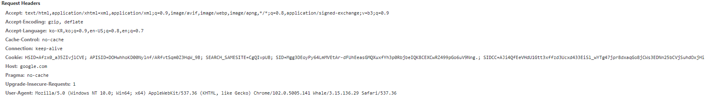
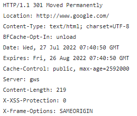

# HTTP와 HTTPS

### HTTP 개요
HTTP(HyperText Transfer Protocol)은 HTML 문서 등의 리소스들을 가져올 수 있도록 하는 `프로토콜`이다. 
HTTP는 OSI 7계층 중 application layer에 해당하며, TCP 기반으로 만들어진 프로토콜이므로, TCP의 특징도 가지고 있다. 
>프로토콜 : 컴퓨터 내부 통신 혹은 컴퓨터 사이의 데이터 교환 방식을 규칙으로 정해놓은 것. 

 

### HTTP의 공통 특징

1. 무상태성 (Stateless)  
    - HTTP는 기본적으로 상태를 저장하지 않고, 요청과 응답이 이루어진 후 연결을 종료함.
    - 다만 쿠키를 통해 클라이언트에서 상태를 저장할 수 있음.
    - 또한 세션을 통해 서버측에서 상태를 관리할 수 있음.
3. TCP 기반 프로토콜.  
    - HTTP는 신뢰할 수 있는 프로토콜을 요구함.
    - 따라서 대표적인 두 개의 프로토콜(TCP, UDP) 중 신뢰 가능한 연결인 TCP를 사용함.
    - 따라서 TCP 연결에 의존적이고, application layer의 입장에서 TCP의 특징도 가지고 있음.
4. 요청(request)과 응답(response)로 이루어져 있음.  
    - 클라이언트의 요청(request)에 대한 응답(response)가 일반적인 HTTP의 통신 방식임.

### HTTP의 버전별 특징

1. HTTP/0.9 
    - HTTP 버전이 추가됨에 따라 생긴 버전(초기에는 버전명이 없었음.)
    - GET 메소드만 있음.
    - HTTP Header가 없음. (HTML 파일만 전송 가능)
    - 상태 코드 및 오류 코드가 존재하지 않음. (해당 파일 내부에 설명과 함께 되돌려 보냄)
2. HTTP/1.0 
    - 요청에 버전 정보가 추가됨.
    - 상태 코드가 추가됨 (요청 성공, 실패여부를 알 수 있음.)
    - HTTP Header가 추가됨. (프로토콜의 확장이 가능해짐)
    - HTTP Header의 'Content-Type'을 통해 HTML 이외의 다른 문서도 전송 가능.
    - HEAD, POST 메소드가 추가됨.
3. HTTP/1.1 
    - Keep-Alive 기능 추가
    - 요청에 Connection Header에 Keep-Alive를 보낼 수 있음.
    - 응답에 Keep-Alive 헤더를 추가적으로 보낼 수 있음.
    - 응답 형식은 Keep-Alive : max=10, timeout=3600
    - 위 응답은 최대 10개의 HTTP 트랜잭션 한번의 연결에 처리할 수 있고, 1시간동안 연결을 유지
    - 아래의 파이프라이닝 기술 사용을 위해 필요함.
    - 파이프라이닝 기능 추가. (한번의 연결에 여러 요청을 처리할 수 있음.)
    - 허용 언어, 인코딩, data type 등을 지정할 수 있음.
4. HTTP/2 
    - 텍스트 방식에서 바이너리 방식으로 바뀜
    - HTTP/1.1의 파이프라이닝 기술을 멀티플렉싱 방식으로 변경함
    - 다음의 방식으로 통신한다.
    - HTTP 메시지를 바이너리 데이터 프레임으로 쪼갬.
    - 전송받은 메시지를 다시 조립하여 사용
    - 스펙 상으로는 TLS가 선택이지만, 사실상 TLS를 필수적으로 적용해야 한다.

5. HTTP/3 
    - HTTP/3는 HTTP/2까지의 연결과는 다르게 QUIC이라는 UDP 기반의 전송 프로토콜을 사용함.
    - QUIC에는 기본적으로 TLS가 적용되어 있다.
    - QUIC은 전송에 필요한 과정을 TCP보다 간략화하여 설계했기 때문에 더 빠른 전송이 가능하다.

---

### HTTPS(HTTP Secure) 란?
> HTTPS는 HTTP 프로토콜을 암호화하기 위해 만들어진 보안 프로토콜이다.  
TLS를 이용하여 전송 계층에서의 암호화를 통해 기밀성을 보장한다.

#### HTTP에 사용되는 TLS
1. 개요.  
예전에는 SSL과 TLS라는 용어를 섞어쓰는 경우가 많았으나, SSL3.0이 TLS1.0으로 대체되었다.  
이 때문에 현재도 구분하지 않고 SSL/TLS라는 용어를 섞어쓰는 경우가 많다.  
TLS는 전송 계층의 보안이며, 현재 가장 TLS1.3 버전까지 있으며, 가장 많이 쓰이는 버전은 TLS1.2이다. 

1. TLS의 서비스
   1. 인증 : 정보를 교환하기 전에 서로에 대한 인증 절차를 통해 검증함.
   2. 암호화 : 데이터가 제 3자에게 읽혀지는 것을 방지하기 위해 암호화함.
   3. 무결성 : 데이터가 위조되거나 변조되었는지를 확인

---
### HTTP request, response

1. HTTP Request
   1. HTTP Line  
        - HTTP Method (GET, PUT, POST, DELETE, HEAD, OPTIONS...)
        - Request Target (URL, protocol, port)
        - HTTP version
   2. HTTP Header  
        - HTTP 헤더의 기본 구조를 따름
        - 예) google.com에 대한 HTTP 요청 헤더  
        
   3. HTTP Body 
2. HTTP Response
   1. HTTP Line  
        - protocol version : 보통 HTTP/1.1인 경우가 많음.
        - HTTP Status Code : 요청의 성공여부 표시
        - HTTP Status Text : Status Code에 대한 설명
   2. HTTP Header  
        - 다른 헤더와 동일한 구조를 따름
        - 예) google.com에 대한 HTTP 응답 헤더 
        
   3. HTTP Body
---
### HTTP request methods

1. GET : 특정 리소스를 요청하는데 사용. 데이터를 가져올때만 사용해야 함.
2. HEAD : `GET` 방식과 동일하지만, 응답 본문을 포함하지 않음.
    - `GET` method로 요청했을 때의 헤더를 요청한다.
    - `HEAD` method에 대한 응답은 본문(Body)를 가져서는 안된다.
    - `Content-Length`와 같은 본문을 설명하는 Entity Header는 포함할 수 있다.
3. POST : 서버로 데이터를 전송하는데 사용. 본문의 유형을 `Content-Type`헤더로 나타냄
    - 서버에 변경 사항을 만듬.
4. PUT : Payload를 이용해 새로운 리소스 생성, 혹은 대상 리소스를 수정하는데 사용
    - `PUT`요청은 `POST`요청과 달리, 같은 요청을 여러번 보내도 같은 결과를 보장함.
5. DELETE : 지정한 리소스 삭제
6. CONNECT : 요청한 리소스에 대해 양방향 연결을 시작하는 메소드
    - HTTPS 연결을 유지하는데 사용됨.
7. OPTIONS : 목표 리소스와의 통신 옵션을 설명하는데 사용
8. TRACE : 루프백 메시지 호출을 위해 테스트용으로 사용됨.
9. PATCH : `PUT`요청과 유사하지만, 대상 리소스의 일부만 수정함.

---
### HTTP Status Code

1. 정보 제공 응답 [100~199]
   1. 100 Continue : 현재 통신 상태가 괜찮음을 표시함.
   2. 101 Switching Protocol
        - Client의 Upgrade 요청 헤더에 대한 응답
        - 서버에서 프로토콜을 변경할 것임을 알려주는 응답.
        - 예) HTTP/1.1에서 HTTP/2로 업그레이드, HTTP에서 HTTPS로 업그레이드
   3. 102 Processing : 서버가 요청을 처리중이며, 아직 제대로 된 응답을 알려줄 수 없음.
2. 성공적인 응답 [200~299]
    1. 200 OK : 요청이 성공적으로 처리됨.
    2. 201 Created : 요청이 성공적으로 처리되었고, 새로운 리소스가 생성됨.
    3. 202 Accepted : 요청이 수락되었으나 아직 처리가 완료되지 않음.
    4. 204 No Content : 요청에 대해 보내줄 수 있는 콘텐츠가 없음. 그러나 헤더는 의미있을 수 있음.
3. 리다이렉트 관련 응답 [300~399]
   1. 300 Multiple Choice : 요청에 대한 하나 이상의 응답이 가능함.
        - Client는 그 중에 하나를 선택해야 함.
   2. 301 Moved Permanently : 요청한 리소스의 URI가 변경되었음을 응답.
        - 새로운 URI가 응답에 포함될 수 있음
        - HTTP > HTTPS로의 Redirect를 위해 자주 사용됨.
4. 클라이언트 에러 응답 [400~499]
   1. 400 Bad Request : 잘못된 문법으로 인해 서버가 요청을 이해하지 못함.
   2. 401 Unautorized 
        - 표준에서는 미승인(unauthorized)이나, 의미상 비인증(unauthenticated)을 의미함
        - Client는 응답을 받기 위해 인증해야함.
        - 예로 Spring Security 등을 사용할 때, 인증 헤더를 보내야 하는 것 등
   3. 403 Forbidden
        - Client가 누구인지는 알고 있으나, 콘텐츠에 접근할 권한이 없음.
   4. 404 Not Found
        - 요청받은 리소스를 찾을 수 없음. 즉, 요청한 리소스가 유효하지 않음.
   5. 405 Method Not Allowed
        - 요청한 메소드를 사용할 수 없음.
        - 주로 `POST` 요청에 `GET`을 사용하는 등 잘못된 Method를 사용하여 많이 발생함.
5. 서버 에러 응답 [500~599]
   1. 500 Internal Server Error
        - 서버가 요청을 처리할 수 없음. 응답 처리 방법을 알 수 없음.
        - 서버가 요청을 처리하는 도중에 오류가 나는 경우 발생
        - Java Server 기준으로는 `NullPointerException`과 같은 예외 발생 시 주로 응답.
   2. 502 Bad Gateway
        - Nginx등 주로 Web Server등의 설정이 잘못된 경우에 자주 발생
        - 게이트웨이 작업중 잘못된 응답을 수신함. 

---
### HTTP와 HTTPS의 차이점 및 연결 과정 
 

#### 차이점
HTTP는 80, HTTPS는 443포트를 사용한다.

(아래는 추후 내용 추가 예정!)
1. HTTP 연결 과정  
    [HTTP 통신 과정](https://mysterico.tistory.com/29)
2. HTTPS 연결 과정  
    [HTTPS 통신 과정](https://nuritech.tistory.com/25)

### 출처 목록
---
HTTP에 관련된 설명 - MDN : https://developer.mozilla.org/ko/docs/Web/HTTP  